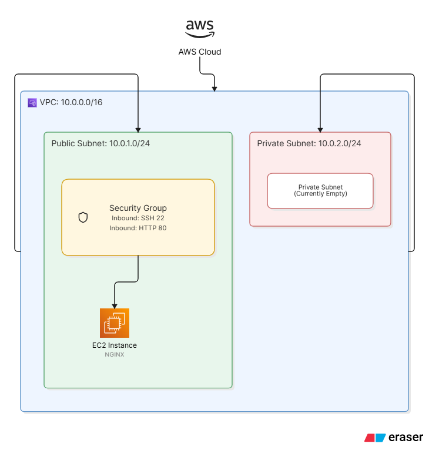
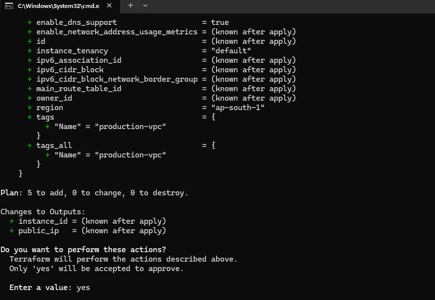
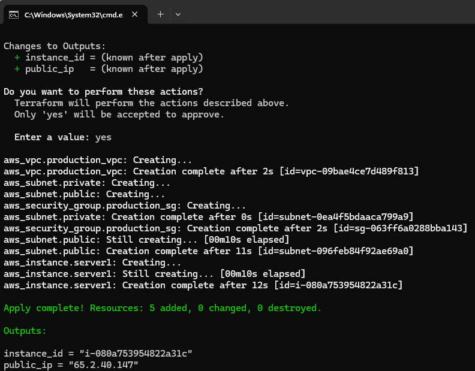
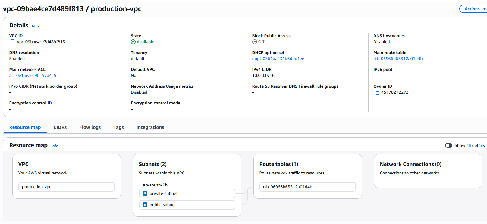
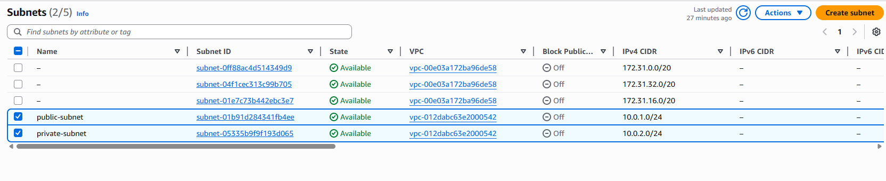
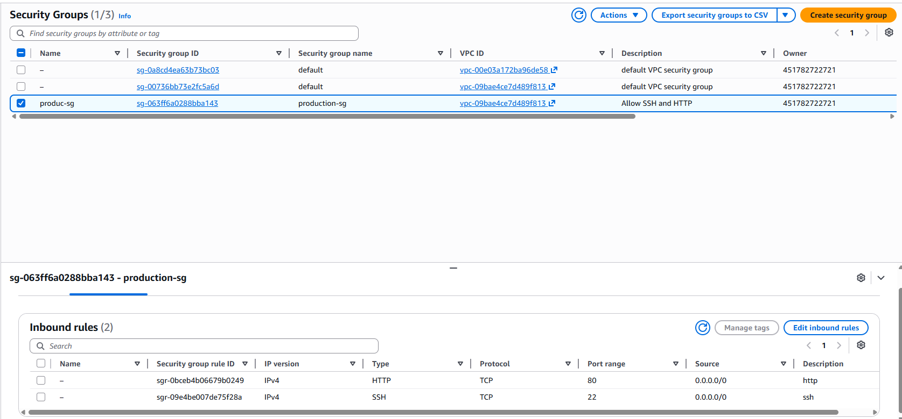
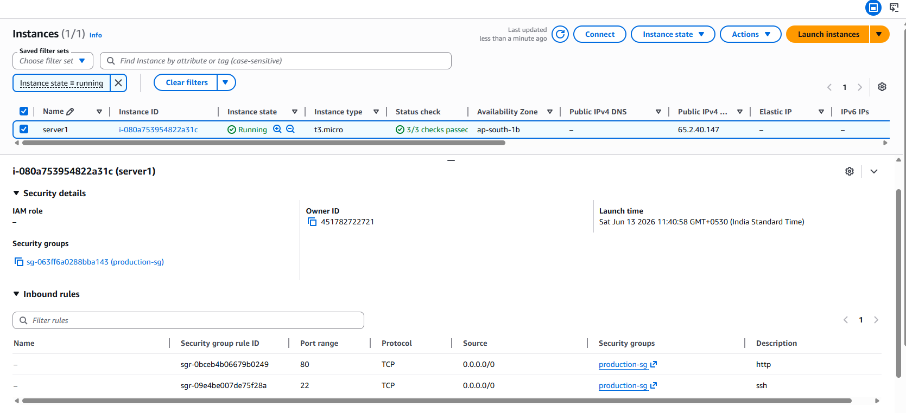
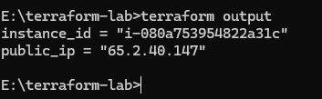

<<<<<<< HEAD
# Terraform AWS Web Infrastructure

Deploy AWS infrastructure using Terraform, including a custom VPC, public and private subnets, security groups, and an EC2 instance.

## Overview

This project demonstrates Infrastructure as Code (IaC) using Terraform to provision a small AWS environment from scratch.

The infrastructure includes:

* Custom VPC
* Public Subnet
* Private Subnet
* Security Group
* EC2 Instance
* Terraform Variables
* Terraform Outputs

This project was created to practice AWS networking fundamentals, Terraform resource dependencies, and infrastructure provisioning.

---

## Architecture



### Infrastructure Layout

```text
AWS Cloud
│
└── VPC (10.0.0.0/16)
    │
    ├── Public Subnet (10.0.1.0/24)
    │     └── EC2 Instance
    │
    └── Private Subnet (10.0.2.0/24)

Security Group
├── SSH (22)
└── HTTP (80)
```

---

## Resources Created

| Resource       | Purpose                                    |
| -------------- | ------------------------------------------ |
| VPC            | Custom AWS network                         |
| Public Subnet  | Hosts public-facing resources              |
| Private Subnet | Reserved for future internal resources     |
| Security Group | Controls inbound and outbound traffic      |
| EC2 Instance   | Compute resource deployed in public subnet |

---
=======
# Terraform AWS EC2 Deployment

Deploy an Amazon EC2 instance on AWS using Terraform with variables, outputs, and resource tagging.

## Overview

This project demonstrates Infrastructure as Code (IaC) using Terraform to provision an EC2 instance in AWS. It uses Terraform variables for configuration, outputs for resource information, and follows a clean project structure suitable for learning and portfolio purposes.

## Features

* Deploy AWS EC2 instance using Terraform
* Configurable through variables
* Resource tagging
* Outputs for instance details
* Version-controlled infrastructure
* Beginner-friendly Terraform project
>>>>>>> af33c2db38991f2ce4dda3744df5169b2aabfa6e

## Project Structure

```text
<<<<<<< HEAD
terraform-aws-web-infrastructure/

├── diagrams/
│   └── architecture.png
│
├── images/
│   ├── terraform-plan.png
│   ├── terraform-apply.png
│   ├── vpc.png
│   ├── subnets.png
│   ├── security-group.png
│   ├── ec2-instance.png
│   └── terraform-output.png
│
├── main.tf
├── variables.tf
├── outputs.tf
├── terraform.tfvars.example
│
=======
terraform-aws-ec2/
├── main.tf
├── variables.tf
├── terraform.tfvars.example
├── outputs.tf
>>>>>>> af33c2db38991f2ce4dda3744df5169b2aabfa6e
├── .gitignore
├── .terraform.lock.hcl
└── README.md
```

<<<<<<< HEAD
---

## Technologies Used

* Terraform
* AWS VPC
* AWS EC2
* AWS Security Groups
* AWS Provider
* Git & GitHub

---

=======
## Technologies Used

* Terraform
* Amazon EC2
* AWS Provider
* Git & GitHub

>>>>>>> af33c2db38991f2ce4dda3744df5169b2aabfa6e
## Prerequisites

Before using this project, ensure you have:

* Terraform installed
* AWS account
* AWS CLI configured
<<<<<<< HEAD
* Appropriate AWS permissions

---

## Configuration

Create:
=======
* Appropriate AWS permissions to create EC2 instances

## Configuration

Create a file named:
>>>>>>> af33c2db38991f2ce4dda3744df5169b2aabfa6e

```text
terraform.tfvars
```

Example:

```hcl
<<<<<<< HEAD
ami_id        = "ami-xxxxxxxxxxxxxxxxx"
instance_type = "t3.micro"
```

---

=======
aws_region    = "ap-south-1"
ami_id        = "ami-xxxxxxxxxxxxxxxxx"
instance_type = "t3.micro"
instance_name = "terraform-web"
```

>>>>>>> af33c2db38991f2ce4dda3744df5169b2aabfa6e
## Terraform Workflow

Initialize Terraform:

```bash
terraform init
```

<<<<<<< HEAD
Format Terraform files:

```bash
terraform fmt
```

=======
>>>>>>> af33c2db38991f2ce4dda3744df5169b2aabfa6e
Validate configuration:

```bash
terraform validate
```

Review execution plan:

```bash
terraform plan
```

Deploy infrastructure:

```bash
terraform apply
```

<<<<<<< HEAD
=======
Refresh Terraform state:

```bash
terraform apply -refresh-only
```

>>>>>>> af33c2db38991f2ce4dda3744df5169b2aabfa6e
Destroy infrastructure:

```bash
terraform destroy
```

<<<<<<< HEAD
---

=======
>>>>>>> af33c2db38991f2ce4dda3744df5169b2aabfa6e
## Outputs

After successful deployment Terraform displays:

<<<<<<< HEAD
* Public IP Address
* Instance ID
=======
* Instance ID
* Public IP Address
* Public DNS
>>>>>>> af33c2db38991f2ce4dda3744df5169b2aabfa6e

Example:

```text
<<<<<<< HEAD
public_ip   = 65.2.40.147
instance_id = i-080a753954822a31c
```

---

=======
instance_id = i-xxxxxxxxxxxxxxxxx
public_ip   = xx.xx.xx.xx
public_dns  = ec2-xx-xx-xx-xx.compute.amazonaws.com
```

>>>>>>> af33c2db38991f2ce4dda3744df5169b2aabfa6e
## Terraform Concepts Demonstrated

* Providers
* Resources
* Variables
* Outputs
<<<<<<< HEAD
* Resource Dependencies
* State Management
* Resource Tagging
* AWS Networking Basics
* VPC and Subnet Configuration

---

## Screenshots

### Terraform Plan



### Terraform Apply



### AWS VPC



### AWS Subnets



### AWS Security Group



### AWS EC2 Instance



### Terraform Outputs



---
=======
* State Management
* Resource Tagging

## Screenshots

### Terraform Apply Successful


### AWS EC2 Instance Running


### Terraform Outputs


>>>>>>> af33c2db38991f2ce4dda3744df5169b2aabfa6e

## Learning Objectives

This project was created to practice:

* Infrastructure as Code (IaC)
<<<<<<< HEAD
* AWS Networking Fundamentals
* Terraform Resource Dependencies
* VPC and Subnet Creation
* Security Group Configuration
* EC2 Provisioning
* GitHub Project Documentation

---

## Future Improvements

Planned upgrades:

* Internet Gateway
* Route Tables
* Route Table Associations
* NGINX Installation using User Data
* Load Balancer
* Multi-Instance Deployment

---

## Author

**Pankaj**

RHCSA Certified Linux Administrator

Learning AWS, Terraform, Cloud Infrastructure, Automation, and Cybersecurity.
=======
* AWS EC2 provisioning
* Terraform state management
* Terraform variables and outputs
* GitHub project organization

## Author

Pankaj

RHCSA Certified Linux Administrator

Learning AWS, Terraform, DevOps, and Cloud Infrastructure
>>>>>>> af33c2db38991f2ce4dda3744df5169b2aabfa6e
